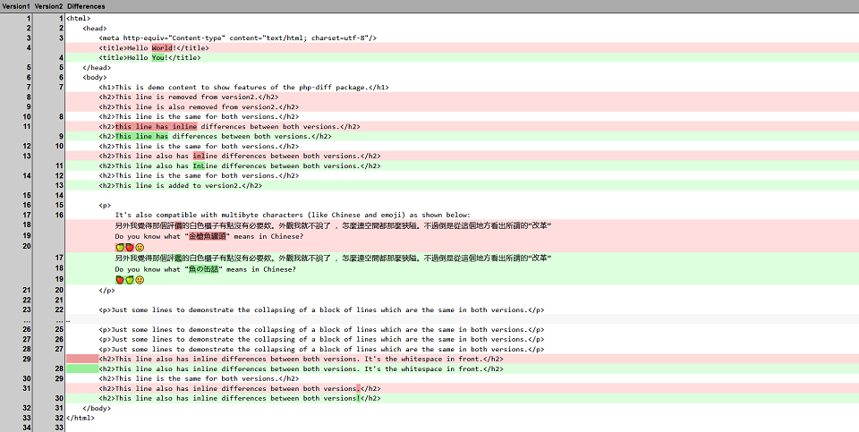
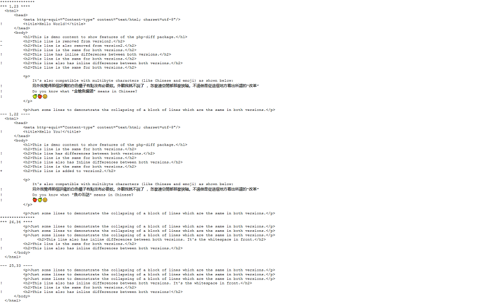

# PHP Diff Class

[](https://www.codacy.com/app/leet31337/php-diff)
[](https://github.com/JBlond/php-diff/releases)
[](https://packagist.org/packages/jblond/php-diff)

## Introduction

A comprehensive library for generating differences between two hashable
objects (strings or arrays). Generated differences can be rendered in all the
standard formats including:

* Unified
* Context
* Side by Side HTML
* Unified HTML
* Unified Commandline colored output

The logic behind the core of the diff engine (ie, the sequence matcher) is
primarily based on the Python difflib package. The reason for doing so is
primarily because of its high degree of accuracy.

## Install

```shell
composer require jblond/php-diff
```

### Install for cli support

For cli usage you need to install the suggested `jblond/php-cli` package.

## Documentation

See the [Wiki](https://github.com/JBlond/php-diff/wiki) for

* [Getting started](https://github.com/JBlond/php-diff/wiki/1.-Getting-Started)
* [Parameters and Options](https://github.com/JBlond/php-diff/wiki/2.-Parameters-and-Options)
* [Custom Renderer](https://github.com/JBlond/php-diff/wiki/3.-Custom-Renderer)
* [Styling](https://github.com/JBlond/php-diff/wiki/4.-Styling)

## Changelog

[Changelog](changelog.md)

## Example Use

```PHP
<?php
use jblond\Diff;
use jblond\Diff\Renderer\Html\SideBySide;

// Installed via composer...
require 'vendor/autoload.php';

$sampleA = file_get_contents(dirname(__FILE__).'/a.txt');
$sampleB = file_get_contents(dirname(__FILE__).'/b.txt');

// Options for generating the diff.
$options = [
    'ignoreWhitespace' => true,
    'ignoreCase'       => true,
    'context'          => 2,
    'cliColor'         => true, // for cli output
    'ignoreLines'      => Diff::DIFF_IGNORE_LINE_BLANK,
];

// Initialize the diff class.
$diff = new Diff($sampleA, $sampleB /*, $options */);

// Choose Renderer.
$renderer = new SideBySide([
    'title1' => 'Custom title for sample A',
    'title2' => 'Custom title for sample B',
]);

// Show the output of the difference renderer.
echo $diff->Render($renderer);

// Alternative
// Show the differences or a message.
echo $diff->isIdentical() ? 'No differences found.' : '<pre>' . htmlspecialchars($diff->render($renderer)) . '</pre>' ;

```

### Example Output

File `example.php` contains a quick demo and can be found in the `example/`
directory. Included is a light and a dark theme.

#### HTML Side By Side Example


<details><summary>More Example Pictures</summary><br>

#### HTML Unified Example



#### Text Unified Example


#### Text Context Example



#### Text Unified Console Example


</details>

<details><summary>HTML Side By Side Dark Theme Example</summary><br>


</details>

## Requirements

* PHP 7.3 or greater
* PHP Multibyte String
* [jblond/php-cli](https://github.com/jblond/php-cli) (suggested)

## Contribution, Issues and feature requests

If you found a bug, or have an idea for new functionality, feel free to report
it on the issue tracker - just use search beforehand.
[Issue tracker](https://github.com/JBlond/php-diff/issues)

You can also fork this repository and open a PR.

## Merge files using jQuery

Xiphe has build a jQuery plugin with that you can merge the compared files. Have
a look
at [jQuery-Merge-for-php-diff](https://github.com/Xiphe/jQuery-Merge-for-php-diff)
.

## Todo

* 3 way diff support

## Contributors

Contributors since I forked the repo.

* maxxer
* Creris
* jfcherng
* [DigiLive](https://github.com/DigiLive)

### License (BSD License)

see [License](LICENSE)

## Tests

```shell
composer run-script phpunit
composer run-script php_src
composer run-script php_test
```
