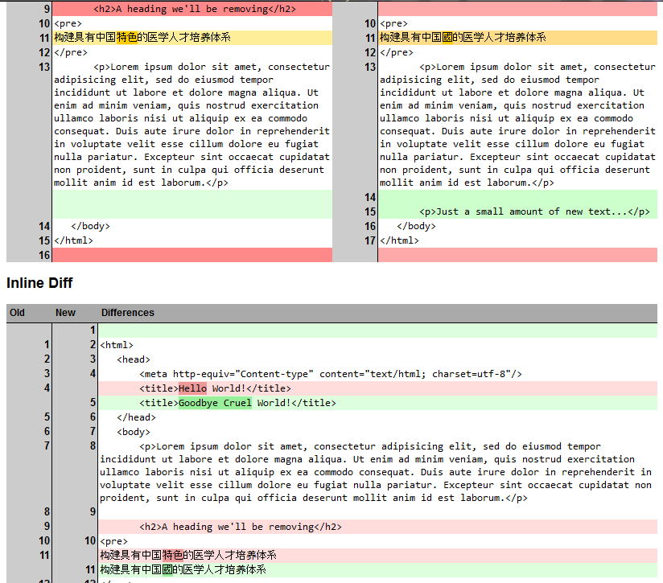
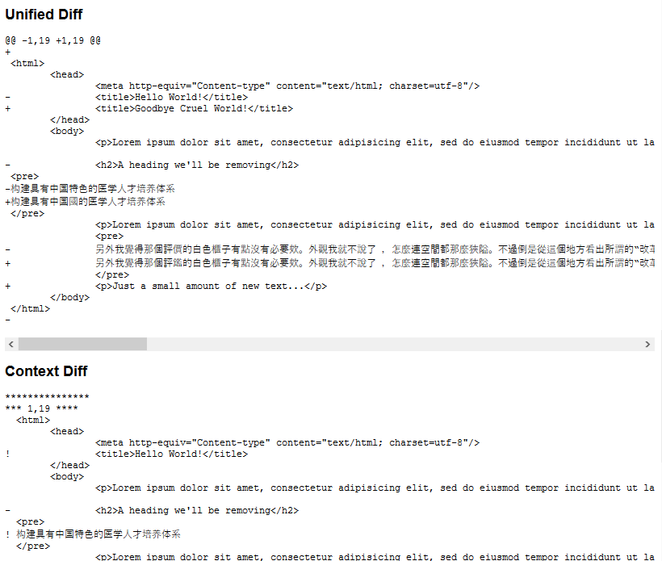

# PHP Diff Class

[](https://insight.sensiolabs.com/projects/aa609edb-cdb1-45cf-ad51-afbdab48f6a1) [](https://www.codacy.com/app/leet31337/php-diff)

[](https://github.com/JBlond/php-diff/releases) [https://packagist.org/packages/jblond/php-diff]

## Introduction

A comprehensive library for generating differences between
two hashable objects (strings or arrays). Generated differences can be
rendered in all of the standard formats including:
* Unified
* Context
* Inline HTML
* Side by Side HTML
* Unified HTML

The logic behind the core of the diff engine (ie, the sequence matcher)
is primarily based on the Python difflib package. The reason for doing
so is primarily because of its high degree of accuracy.


## Install

```shell
composer require jblond/php-diff
```

## Example Use

```PHP
<?php
// Installed via composer...
require 'vendor/autoload.php';
// ...or installed manually.
require dirname(__FILE__).'/../lib/Autoloader.php';

new \jblond\Autoloader(); 

$a = file_get_contents(dirname(__FILE__).'/a.txt');
$b = file_get_contents(dirname(__FILE__).'/b.txt');

// Options for generating the diff.
$options = [
    //'ignoreWhitespace' => true,
    //'ignoreCase' => true,
];

// Initialize the diff class.
$diff = new \jblond\Diff($a, $b, $options);

// Choose Renderer.
$renderer = new \jblond\Diff\Renderer\Html\SideBySide([
    'title_a' => 'Custom title for OLD version',
    'title_b' => 'Custom title for NEW version',
]);

// Show it.
echo $diff->Render($renderer);
```

### Example Output
A quick usage example can be found in the example/ directory and under
example.php.





## Requirements

* PHP 7.2 or greater
* PHP Multibyte String 

## Merge files using jQuery

Xiphe has build a jQuery plugin with that you can merge the compared
files. Have a look at [jQuery-Merge-for-php-diff](https://github.com/Xiphe/jQuery-Merge-for-php-diff).

## Todo

* Ability to ignore blank line changes
* 3 way diff support
 
## Contributors

Contributors since I forked the repo.

* maxxer
* Creris
* jfcherng
* DigiLive

### License (BSD License)

see [License](LICENSE)

## Tests

```shell
composer run-script phpunit
composer run-script php_src
composer run-script php_test
```
